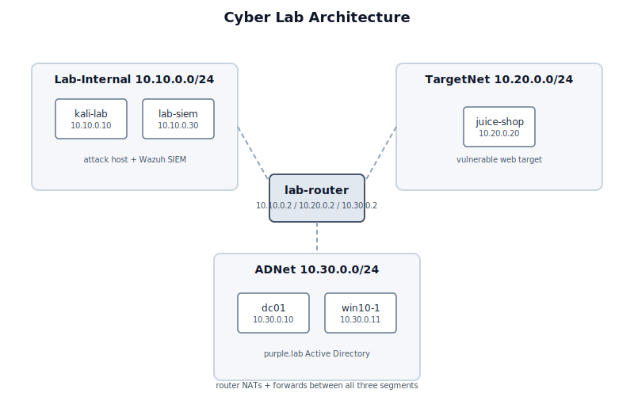

# Cyber Lab

A self-contained, purple-team AD / SIEM lab that spins up in VirtualBox + Vagrant.

> **One-liner:** Build a segmented network, attack a real Active Directory domain from Kali, and watch Wazuh detect every step.



## Why this project

Most security labs are either pure red-team (attack, no detection) or pure blue-team (rules, no realistic attack source). This repo demonstrates both sides end-to-end:

* **Infrastructure as code** — six VMs, three network segments, routing, NAT, and SIEM provisioning are all in a single `Vagrantfile`.
* **Real AD attack paths** — Kerberoasting, AS-REP roasting, and SMB brute-force against a Windows Server 2022 DC.
* **Detection engineering** — custom Wazuh rules that map the same attacks to MITRE ATT&CK techniques.
* **Portfolio-ready** — every secret is externalised to `.env`; diagrams and alert extracts are included.

## What's inside

| Segment | CIDR | Members |
|---------|------|---------|
| Lab-Internal | `10.10.0.0/24` | Kali attack host (`10.10.0.10`), Wazuh SIEM (`10.10.0.30`), router inside (`10.10.0.2`) |
| TargetNet | `10.20.0.0/24` | OWASP Juice Shop target (`10.20.0.20`) |
| ADNet | `10.30.0.0/24` | Windows Server 2022 DC (`10.30.0.10`), Windows 10 client (`10.30.0.11`) |

| VM | Box | Purpose |
|----|-----|---------|
| `router` | `ubuntu/jammy64` | iptables gateway + NAT between segments |
| `siem` | `ubuntu/jammy64` | Wazuh 4.10.1 single-node SIEM (Docker) |
| `kali` | `kalilinux/rolling` | Attack platform with Impacket, netexec, BloodHound.py |
| `target` | `ubuntu/jammy64` | OWASP Juice Shop vulnerable web app |
| `dc` | `gusztavvargadr/windows-server-2022-standard` | Active Directory domain controller for `purple.lab` |
| `win10` | `StefanScherer/windows_10` | Domain-joined Windows 10 client |

### Detections

Custom Wazuh rules live in [`wazuh-rules/custom_ad_rules.xml`](wazuh-rules/custom_ad_rules.xml) and are installed by the SIEM provisioner as `0599-custom_ad_rules.xml` so they load after the built-in Windows Security rules.

| Rule ID | MITRE | Description | Status |
|---------|-------|-------------|--------|
| `100300` | T1558.003 | Kerberoasting: weakly encrypted TGS for a user account | ✅ Verified |
| `100301` | T1558.004 | AS-REP roasting: TGT requested without pre-authentication | ✅ Verified |
| `100302` | T1110 | Valid NTLM network logon from the external subnet | ✅ Verified |
| `100305` | T1110 | Failed NTLM network logon from the external subnet | ✅ Verified |
| `100303` | T1110.001 | SMB brute-force: 5 failed NTLM logons in 60 s | ✅ Verified |
| `100306` | T1003.006 | DCSync: directory replication access requested | ✅ Verified |
| `100310` | T1110.003 | Password spraying against multiple users | ✅ Verified |
| `100320` | T1558.001 | Golden Ticket indicator (suspicious TGS options) | 📝 Syntactic rule |

See the detailed playbooks in [`docs/detections/`](docs/detections/).

## Alerting and response

The lab includes a custom Wazuh integration that forwards high-severity alerts (level 10+) to a webhook, plus a staged PowerShell Active Response script for temporary firewall blocks on the DC.

| Component | Status |
|-----------|--------|
| Webhook alerting (`custom-wazuh-notify`) | ✅ Verified live — SMB brute-force rule 100303 (level 12) was delivered to the Kali webhook receiver with MITRE enrichment. |
| Active Response firewall block | 🔧 Wired but unstable — `firewall-block.ps1` / `firewall-block.cmd` are in the DC agent's `active-response\bin\`, the manager-side `<command>` / `<active-response>` block is configured via the file-bytes method, and the script works locally, but the Wazuh manager/agent instability prevents the automatic trigger → block → timeout loop from completing end-to-end. |

See [`docs/response/README.md`](docs/response/README.md) for configuration, verification output, and the honest deferred-items list.

## Quick start

1. Install prerequisites:
   * [VirtualBox](https://www.virtualbox.org/)
   * [Vagrant](https://www.vagrantup.com/)
   * `vagrant plugin install vagrant-reload`

2. Clone the repo and move into it:

   ```powershell
   cd cyber-lab
   ```

3. Copy the secrets template and fill in strong values:

   ```powershell
   Copy-Item .env.example .env
   notepad .env
   ```

   `.env` is gitignored and must never be committed.

4. Bring up the lab:

   ```powershell
   vagrant up
   ```

5. SSH into Kali and run the verification commands from [`docs/detections/`](docs/detections/).

6. Open the Wazuh dashboard:

   ```text
   https://10.10.0.30
   Username: admin
   Password: <value of LAB_WAZUH_DASHBOARD_PW in .env>
   ```

## Alert gallery

Example alert JSON for each verified rule is in [`docs/img/alert-gallery.md`](docs/img/alert-gallery.md).

## Lessons learned

Operational notes, debugging tips, and design decisions are collected in [`LESSONS.md`](LESSONS.md).

## Snapshots

After a successful build, snapshot every VM so you can roll back to a clean state:

```powershell
vagrant snapshot save router clean-phase4
vagrant snapshot save siem clean-phase4
vagrant snapshot save kali clean-phase4
vagrant snapshot save target clean-phase4
vagrant snapshot save dc clean-phase4
vagrant snapshot save win10 clean-phase4
```

## ⚠️ Not for production

This lab deliberately contains weak passwords, disabled firewalls, and misconfigured ACLs. Run it only on an isolated host and never expose the VMs to untrusted networks.

## License

[MIT](LICENSE)
